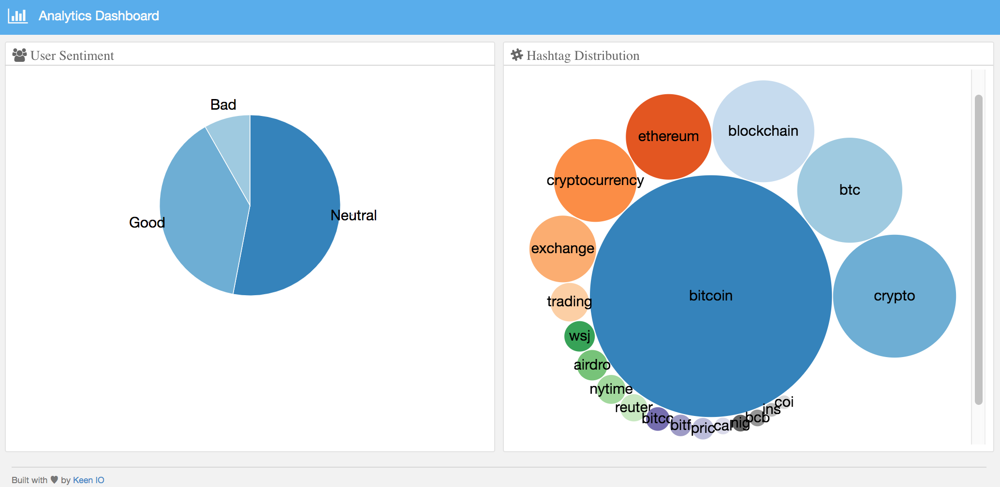

= Twitter Analytics Bot on EKS

== About

* link:#part-1---requirements[Part 1 - Requirements]
* link:#part-2---deploy-eks-cluster[Part 2 - Deploy EKS Cluster]
* link:#part-3---setup-cluster-ingress[Part 3 - Setup Cluster Ingress]
* link:#part-4---deploy-twitter-bot[Part 4 - Deploy Bot]
* link:#part-5---setup-wavefront[Part 5 - Wavefront]

== Assumptions
* You already have an AWS account with typical permissions to create EC2 resources, EKS clusters
* A Twitter application API key (https://developer.twitter.com/)

[#requirements]
= Part 1 - Requirements
If you are currently already developing with EKS and Kubernetes, feel free to skip to Part 2. Otherwise, visit link:https://github.com/bbertka/setup-eks-dev-env[Setting up your EKS Dev Environment] for instructions on how to set up your machine with the proper tools needed to continue this lab.

[#deploy-eks-cluster]
= Part 2 - Deploy EKS Cluster
In order to deploy the Docker image for the Twitter Bot, we need an EKS cluster to work with.  There are two options for us for backing an EKS cluster, Fargate, or your own managed VPC nodes.  For visibility into K8s IaaS, we are opting for a managed EC2 backend deployment.

. Download or copy your AWS public SSH key to your current directory and make sure the permissions are set securely.
+
----
$ cp ~/eks.pub . && chmod 600 eks.pub
----

. Create an EKS cluster in your region, with a node size capable of running a single instance of the Bot (need to experiment and document here what the smallest can be)
+
----
$ eksctl create cluster \
 --name twitterbot \
 --version 1.19 \
 --region us-east-2 \
 --nodegroup-name linux-nodes \
 --node-type t2.small \
 --nodes 1 \
 --nodes-min 1 \
 --nodes-max 1 \
 --ssh-access \
 --ssh-public-key eks.pub \
 --managed
----

. After 10-15 minutes, test that Kubectl has been configured and see the ready status of your cluster nodes.
+ 
----
$ kubectl get nodes
NAME                                           STATUS   ROLES    AGE     VERSION
ip-192-168-10-182.us-east-2.compute.internal   Ready    <none>   3m46s   v1.17.9-eks-4c6976
----

[#setup-cluster-ingress]
= Part 3 - Setup Cluster Ingress
To have access to the bot dashboard via the browser, we need to load balance to the running container within Kubernetes. To do this we create an Application Load Balancer.  Fortunetly, AWS provides an ALB controller to make this easy for us which integrates nicely with EKS.

. Create an IAM OIDC provider and associate it with your cluster
+
----
$ eksctl utils associate-iam-oidc-provider \
    --region us-east-2 \
    --cluster twitterbot \
    --approve
----

. Download an IAM policy for the ALB Ingress Controller pod that allows it to make calls to AWS APIs on your behalf
+
----
curl -o iam-policy.json https://raw.githubusercontent.com/kubernetes-sigs/aws-alb-ingress-controller/v1.1.8/docs/examples/iam-policy.json
----

. Create an IAM policy called ALBIngressControllerIAMPolicy using the policy downloaded in the previous step.  Take note of the ARN policy string that was created for a following step.
+
----
$ aws iam create-policy \
    --policy-name ALBIngressControllerIAMPolicy \
    --policy-document file://iam-policy.json
----

. Create a Kubernetes service account named alb-ingress-controller in the default namespace, a cluster role, and a cluster role binding for the ALB Ingress Controller to use with the following command
+
----
kubectl apply -f rbac-role.yml
----

. Create an IAM role for the ALB Ingress Controller and attach the role to the service account created in the previous step. The command that follows only works for clusters that were created with eksctl.  Note use your ARN from the previous step.
+
----
eksctl create iamserviceaccount \
    --region us-east-2 \
    --name alb-ingress-controller \
    --namespace default \
    --cluster twitterbot \
    --attach-policy-arn arn:aws:iam::370534301218:policy/ALBIngressControllerIAMPolicy \
    --override-existing-serviceaccounts \
    --approve
----

. Deploy your ALB Controller, note that initially it will error until the subsequent steps
+
----
$ kubectl apply -f alb-ingress.yml
----

. Edit the ALB Deployment with your cluster name, your EKS VPC, and region
+
----
kubectl edit deployment.apps/alb-ingress-controller

...
    spec:
      containers:
      - args:
        - --ingress-class=alb
        - --cluster-name=twitterbot
        - --aws-vpc-id=vpc-0dab680d6770192eb
        - --aws-region=us-east-2
----

. Confirm that the ALB Ingress Controller is running with the following command.
+
----
$ kubectl get pods
NAME                                      READY   STATUS    RESTARTS   AGE
alb-ingress-controller-646d767ccf-4h624   1/1     Running   0          12s
----

. Create the Twitter Bot Service
+
----
$ kubectl apply -f twitter-bot-service.yml
service/service-twitter-bot created 
----

. Create the ALB Ingress
+
----
$ kubectl apply -f twitter-bot-ingress.yml
ingress.extensions/twitter-bot-ingress created
----

. Obtain the ALB Ingress address
+
----
$ kubectl get ingress
NAME              CLASS    HOSTS   ADDRESS                                                                 PORTS   AGE
twitterbot-ingress   <none>   *       58c8349a-default-twitterbotin-89de-245843308.us-east-2.elb.amazonaws.com   80      3d1h

For issues with Loadbalancer creation, please verify proper tags are set on your VPC subnets:
Please see https://aws.amazon.com/premiumsupport/knowledge-center/eks-vpc-subnet-discovery/
----

[#deploy-twitterbot]
= Part 4 - Deploy Twitter Bot

. Deploy Twitter Bot (make sure to update your env vars)
+
----
$ kubectl apply -f twitter-bot-deployment.yaml
----

. If all goes well you should see output as such:
+
----
bash-3.2$ kubectl get all
NAME                                          READY   STATUS    RESTARTS   AGE
pod/alb-ingress-controller-78cf8c58fb-7ltdw   1/1     Running   0          25m
pod/twitterbot-7bdffc4f95-9nxnn               1/1     Running   0          6m58s

NAME                          TYPE        CLUSTER-IP       EXTERNAL-IP   PORT(S)        AGE
service/kubernetes            ClusterIP   10.100.0.1       <none>        443/TCP        4h13m
service/service-twitter-bot   NodePort    10.100.173.113   <none>        80:30025/TCP   24m

NAME                                     READY   UP-TO-DATE   AVAILABLE   AGE
deployment.apps/alb-ingress-controller   1/1     1            1           26m
deployment.apps/twitterbot               1/1     1            1           6m58s

NAME                                                DESIRED   CURRENT   READY   AGE
replicaset.apps/alb-ingress-controller-78cf8c58fb   1         1         1       25m
replicaset.apps/alb-ingress-controller-b978db5c9    0         0         0       26m
replicaset.apps/twitterbot-7bdffc4f95               1         1         1       6m59s
----

After a few minutes, open the browser and connect to your instance on the ALB address

[#setup-wavefront]]
= Part 5 - Wavefront

. Install  Helm
+
----
$brew install helm
----

. Install Wavefront repos
+
----
$helm repo add wavefront https://wavefronthq.github.io/helm/ && helm repo update
----

. Create a Wavefront namespace and install
+
----
$kubectl create namespace wavefront && helm install wavefront wavefront/wavefront \
    --set wavefront.url=https://longboard.wavefront.com \
    --set wavefront.token=yourtoken here \
    --set clusterName="twitterbot" --namespace wavefront
----

. Or Follow the Waverfront instructions on the Integrations Tab

. Scale down to save
+
----
  eksctl scale nodegroup --cluster twitterbot --name linux-nodes --nodes 0 --nodes-min 0
----

== Congratulations! You have deployed a twitterbot via EKS with Wavefront monitoring

