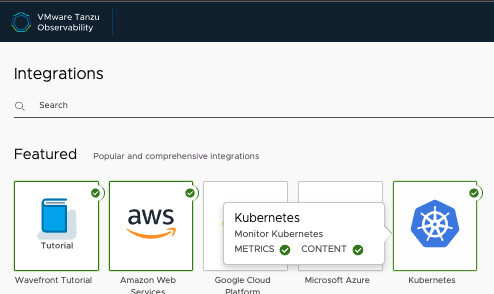
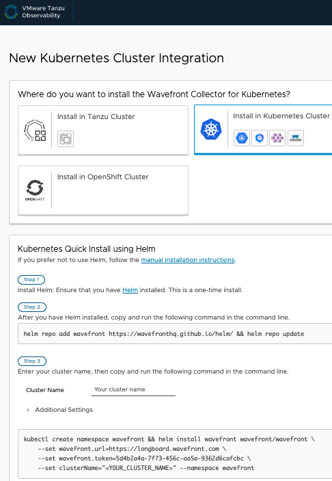
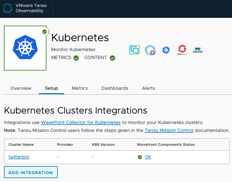
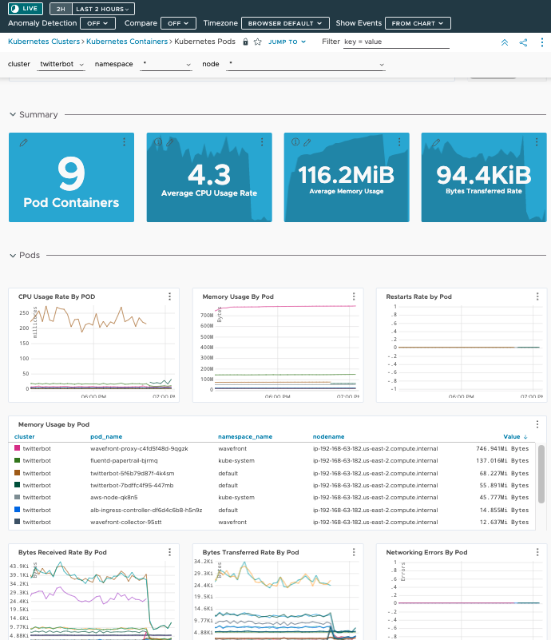

= Twitter Analytics Bot on EKS

image:img/twitter-bot.png[]

== About

*Update* Need to refactor fro K8s changes

* link:#part-1---requirements[Part 1 - Requirements]
* link:#part-2---deploy-eks-cluster[Part 2 - Deploy EKS Cluster]
* link:#part-3---setup-cluster-ingress[Part 3 - Setup Cluster Ingress]
* link:#part-4---deploy-twitter-bot[Part 4 - Deploy Bot]
* link:#part-5---setup-wavefront[Part 5 - Wavefront]

== Assumptions
* You already have an AWS account with typical permissions to create EC2 resources, EKS clusters
* A Twitter application API key (https://developer.twitter.com/)

[#requirements]
= Part 1 - Requirements
If you are currently already developing with EKS and Kubernetes, feel free to skip to Part 2. Otherwise, visit link:https://github.com/bbertka/setup-eks-dev-env[Setting up your EKS Dev Environment] for instructions on how to set up your machine with the proper tools needed to continue this lab.

[#deploy-eks-cluster]
= Part 2 - Deploy EKS Cluster
In order to deploy the Docker image for the Twitter Bot, we need an EKS cluster to work with.  There are two options for us for backing an EKS cluster, Fargate, or your own managed VPC nodes.  For visibility into K8s IaaS, we are opting for a managed EC2 backend deployment.

. Download or copy your AWS public SSH key to your current directory and make sure the permissions are set securely.
+
----
$ cp ~/eks.pub . && chmod 600 eks.pub
----

. Create an EKS cluster in your region, with a node size capable of running a single instance of the Bot (need to experiment and document here what the smallest can be)
+
----
$ eksctl create cluster \
 --name twitterbot \
 --version 1.24 \
 --region us-east-2 \
 --nodegroup-name linux-nodes \
 --node-type t2.medium \
 --nodes 1 \
 --nodes-min 1 \
 --nodes-max 1 \
 --ssh-access \
 --ssh-public-key eks.pub \
 --managed
----

. After 10-15 minutes, test that Kubectl has been configured and see the ready status of your cluster nodes.
+ 
----
$ kubectl get nodes
NAME                                           STATUS   ROLES    AGE     VERSION
ip-192-168-3-103.us-east-2.compute.internal   Ready    <none>   8m48s   v1.24.13-eks-0a21954
----

[#setup-cluster-ingress]
= Part 3 - Setup Cluster Ingress
. Download the default IAM policy from AWS here: 
+
----
$ curl -O https://raw.githubusercontent.com/kubernetes-sigs/aws-load-balancer-controller/v2.4.7/docs/install/iam_policy.json
----

. Create the IAM policy
+
----
$ aws iam create-policy --policy-name AWSLoadBalancerControllerIAMPolicy --policy-document file://iam_policy.json
{
    "Policy": {
        "PolicyName": "AWSLoadBalancerControllerIAMPolicy",
        "PolicyId": "XXXXXXXXXXXXXXXXXXXXXX",
        "Arn": "arn:aws:iam::XXXXXXXXXXXXX:policy/AWSLoadBalancerControllerIAMPolicy",
        "Path": "/",
        "DefaultVersionId": "v1",
        "AttachmentCount": 0,
        "PermissionsBoundaryUsageCount": 0,
        "IsAttachable": true,
        "CreateDate": "2023-06-30T19:20:37+00:00",
        "UpdateDate": "2023-06-30T19:20:37+00:00"
    }
}
----

. Associating IAM OIDC provider
+
----
$ eksctl utils associate-iam-oidc-provider \
    --region us-east-2 \
    --cluster twitterbot \
    --approve
----

. Create IAM service account
+
----
$ eksctl create iamserviceaccount \
  --cluster=twitterbot \
  --namespace=kube-system \
  --name=aws-load-balancer-controller \
  --role-name AmazonEKSLoadBalancerControllerRole \
  --attach-policy-arn=arn:aws:iam::XXXXXXXXXXXX:policy/AWSLoadBalancerControllerIAMPolicy \
  --approve
----

. Add the eks-charts Helm repo and install the AWS load balancer controller
+
----
$ helm repo add eks https://aws.github.io/eks-charts

$ helm repo update eks

$ helm install aws-load-balancer-controller eks/aws-load-balancer-controller \
  -n kube-system \
  --set clusterName=twitterbot \
  --set serviceAccount.create=false \
  --set serviceAccount.name=aws-load-balancer-controller
----

[#deploy-twitterbot]
= Part 4 - Deploy Twitter Bot

. Deploy Twitter Bot (make sure to update your env vars)
+
----
$ kubectl apply -f twitterbot-deployment.yml
----

. If all goes well you should see output as such:
+
----
bash-3.2$ kubectl get all
NAME                                          READY   STATUS    RESTARTS   AGE
pod/alb-ingress-controller-78cf8c58fb-7ltdw   1/1     Running   0          25m
pod/twitterbot-7bdffc4f95-9nxnn               1/1     Running   0          6m58s

NAME                          TYPE        CLUSTER-IP       EXTERNAL-IP   PORT(S)        AGE
service/kubernetes            ClusterIP   10.100.0.1       <none>        443/TCP        4h13m
service/service-twitter-bot   NodePort    10.100.173.113   <none>        80:30025/TCP   24m

NAME                                     READY   UP-TO-DATE   AVAILABLE   AGE
deployment.apps/alb-ingress-controller   1/1     1            1           26m
deployment.apps/twitterbot               1/1     1            1           6m58s

NAME                                                DESIRED   CURRENT   READY   AGE
replicaset.apps/alb-ingress-controller-78cf8c58fb   1         1         1       25m
replicaset.apps/alb-ingress-controller-b978db5c9    0         0         0       26m
replicaset.apps/twitterbot-7bdffc4f95               1         1         1       6m59s
----

After a few minutes, open the browser and connect to your instance on the ALB address

[#setup-wavefront]]
= Part 5 - Wavefront

. Go to Integrations tab and select Kubernetes

. Follow the instructions on how to set up for a standard Kubernetes cluster

. Some instructions here

. Install  Helm
+
----
$brew install helm
----

. Install Wavefront repos
+
----
$helm repo add wavefront https://wavefronthq.github.io/helm/ && helm repo update
----

. Create a Wavefront namespace and install using the instructions on your integrations tab in the Wavefront GUI
+
----
$kubectl create namespace wavefront && helm install wavefront wavefront/wavefront \
    --set wavefront.url=https://longboard.wavefront.com \
    --set wavefront.token=yourtoken here \
    --set clusterName="twitterbot" --namespace wavefront
----

. Check Kubernetes to see what's been deployed by the Wavefront Helm chart
+
----
bash-3.2$ kubectl get all --namespace wavefront
NAME                                  READY   STATUS    RESTARTS   AGE
pod/wavefront-collector-95stt         1/1     Running   0          165m
pod/wavefront-proxy-c4fd5f48d-9qgzk   1/1     Running   0          5d2h

NAME                      TYPE        CLUSTER-IP      EXTERNAL-IP   PORT(S)    AGE
service/wavefront-proxy   ClusterIP   10.100.17.227   <none>        2878/TCP   5d3h

NAME                                 DESIRED   CURRENT   READY   UP-TO-DATE   AVAILABLE   NODE SELECTOR   AGE
daemonset.apps/wavefront-collector   1         1         1       1            1           <none>          5d3h

NAME                              READY   UP-TO-DATE   AVAILABLE   AGE
deployment.apps/wavefront-proxy   1/1     1            1           5d3h

NAME                                        DESIRED   CURRENT   READY   AGE
replicaset.apps/wavefront-proxy-c4fd5f48d   1         1         1       5d3h
----

. Great, now you have set up the K8s integration, so easy!

. Check the dashboards created for your K8s integration

. Scale down to save
+
----
  eksctl scale nodegroup --cluster twitterbot --name linux-nodes --nodes 0 --nodes-min 0
----

== Congratulations! You have deployed a twitterbot via EKS with Wavefront monitoring

== Next Step: Python Wavefront Integration

. https://docs.wavefront.com/python.html
